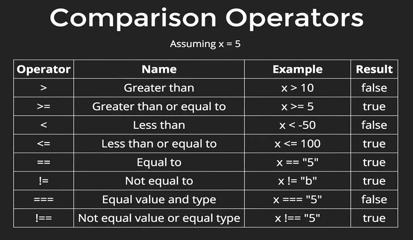
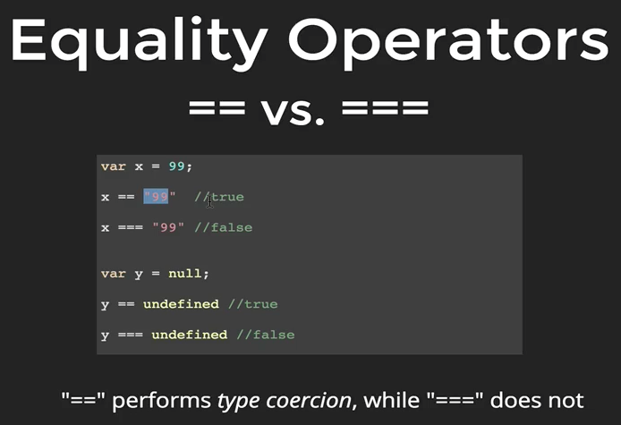
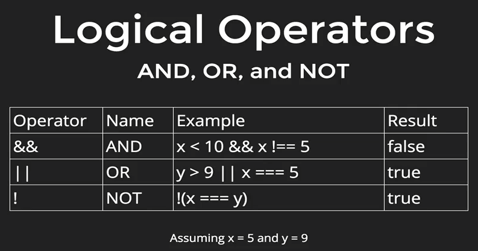

# Be Strong in JavaScript

by mediocademy


## Section 1 - JavaScript console

```>``` Buka browser chrome > klik kanan dan inspect > pilih tab console.

```>``` Di console ketikan code dibawah ini:

```javascript
const greet = "Hello guys..."
const say = "Welcome to mediocademy"

alert(greet + say)


```


## Section 2 - Basic built-in Primitive data type.

### 5 Primitive Data types

**1. Number**

```
4
9.3
-10
```


**2. String**

```
"Hello Bumi"
"43"
```

**3. Boolean**

```
true
false
```

**4 null**

```
null
```

**5. undefined**

```
undefined
```


**1. Number**

```javascript
// Number
4
9
-10
234523452345

// Operation math
4 + 10
1/5

// Modulo: remainder operator 
10 % 4   //2
24 % 2   //0
15 % 10  //5
```


**2. String**

```javascript
// Single and Double quotes
"hello medio"
'hello medio'

// concatenation
"medio" + "cademy"
"Hi " + "medio" + "cademy"

// Escape Character menggunakan "\" (backslash)
"Belajar \"JavaSript\", bersama Mediocademy"

// atau mix "" dan ''
"Belajar 'JavaSript', bersama Mediocademy"

"Cara menuliskan backslash pada string \\"

// Length property
"hello mediocademy".length

// Mengakses individual character menggunakan [] dan index
"mediocademy"[0]
"mediocademy"[5]
```


**LATIHAN**

```javascript
// 1
100 % 3
30 % 10

// 2
("medio" + "cademy" + "fullstackJS")[10]
("medio" + "cademy" + "fullstackJS")[20]

// 3
"fullstack".length % "javascript".length
"fullstack".length / "javascript".length
"fullstack".length - "\'js\' developer".length
```


### Variable

Variable adalah container yang digunakan untuk menyimpan data.

Contoh membuat variable dalam javascript:

```javascript
// Pattern camelCase 
var yourVariableName = "yourValue";
let camelCase = "pola camel case";

// Menyimpan String
var name = "Medio Cademy";

// Menyimpan Number
var pinNumber = 7368;

// Menyimpan Boolean
var isHandsome = true

// Cara memanggil data dengan nama variable nya
var name = "Dyo Medio"
"hello " + name

var num = 197;
num + 3 / 100;

// Update eksis data
var name = "Dyo";
name = "John";
```


### Null dan Undefined

Null dan Undefined termasuk primitive type data:

**Undefined** adalah variable yang sudah di declare tapi belum di initial data atau belum diberin nilai.

contoh:

```			javascript
var playerOne;
var age;
```


**Null** adalah variable yang menandakan kosong atau empty.

contoh:

```javascript
var playerOne = "john";
playerOne = null;
```


### JavaScript 'built in' Method

Antara lain:

* alert
* prompt
* console.log
* clear()


**Latihan**:

```javascript
// 1. Alert
alert("hello guys !");
alert(20 * 10);

// 2a. console log
console.log("print out to de console");

// 2b. coba juga di tab source > snippets
console.log("print out from source snippets");

// 3 prompt()
prompt("What is your class? ");

// 3a. menyimpan kedalam variable
var kelas = prompt("what is your class name? ");

// 3b. menyimpan ke dalam variable dan mencetak ke console
var teacherName = prompt("what is your teacher name? ");
console.log(teacherName);
```


**Latihan**

Menuliskan javascript kode ke dalam file terpisah.

```>``` Menggunakan inspect

Pada Source > buatlah Snippets yang baru, beri nama "script.js", kemudian tuliskan kode dibawah:

```  javascript
var cityName = prompt("What is your city?")
alert(cityName + " Kota yang indah");
console.log("Memang betul " + cityName + " kota bagus...")
// menggunakan es6 template string
console.log(`Memang betul ${cityName} kota nya indah`)
```

Kemudian tekan control + enter.


```>``` Menggunakan code editor buatlah file html dan file javascript terpisah, buatlah **prompt()** dengan pertanyaan sbb:

``` 
* user first name
* user last name
* user age
* print out console user full name
* print out console tambahkan age dengan kalimat / string
* Gunakan template literal string es6
```


```>``` Membuat Age Calculator

```
* Menampilkan pertanyaan umur user dengan prompt kemudian di conversikan umur user dengan hari.
* print out console dengan string "Umur anda sekarang ... dan anda kira-kira sudah hidup dalam ... hari".
```

**Hint**

```
1 tahun = 365 hari
```

 

## Section 3 - Control flow

#### Boolean Logic

Adalah statement yang di compare dimana output nya antara True dan False

**Comparison Operator**




**Keterangan**

```==``` : equal value 

```===``` : equal value and equal type


**Equality Operator**





**Another case**

```
true == "1"						//true

0 == false						//true

null == undefined			//true

NaN == NaN						//false
```


**Logical Operator**




**Keterangan**

```&&``` kedua statemen harus true agar result menjadi true.

```||``` hanya membutuhkan 1 buah statement true agar result menjadi true.


**Latihan 1** 

```
var x = 10;
var y = "a";

y === "b" || x >= 10
```

**Latihan 2**

```
var x = 3;
var y = 8;

!(x == "3" || x === y) && !(y !=8 && x <= y)
```

**Hint**

Jika left side is true maka right side otomatis akan true.

&&

Jika left side is false maka right side otomatis akan false.


## JS Conditional

Membuat keputusan dengan code.

* **If**
* **Else If**
* **Else**


Misal ada sebuah kasus sbb:

Jika umur anda lebih muda dari 18 tahun ==> anda tidak dapat masuk ke ruang itu.

Jika umur anda antara 18 dan 21 tahun ==> anda boleh masuk tapi tidak boleh duduk.

Diluar dari umur diatas anda boleh masuk dan duduk.

Dengan JS Conditional kita buat kode nya seperti berikut:

```
var age;
if (age < 18) {
	console.log("Sorry you are not old enough to enter the room")
} else if(age < 21) {
	console.log("You can enter the room but can not sit")
} else {
	console.log("You can enter and sitdown .. relax man")
}
```


**Latihan**

```
if age is negative
	print an error message

if age is 21
	print "happy 21st birthday!"
	
if age is odd
	print "your age is odd!"
	
if age is a perfect square
	print "perfect square!"
		
```

**Hint**

```
// Get age and convert it to a Number (prompt always returns a String)
var age = Number(prompt("What is your age?"));

// If age is negative
if(age < 0) {
 console.log("Come back once you're out of the womb");
}

// If age is 21  
if(age === 21) {
 console.log("Happy 21st Birthday!");
}

// If age is odd
//(not evenly divisible by two)
if(age % 2 !== 0) {
 console.log("Your age is odd!");
}

// If age is a perfect square
if(age % Math.sqrt(age) === 0) {
  console.log("Your age is a perfect square!");
}
```


## Latihan Membuat permainan sederhana tebak angka 

Anda dapat melihat source code nya pada github.com dibawah ini:

https://github.com/vanbumi/tebak-angka


## Loops


#### While Loops

Contoh:

```javascript
// string yang akan di loop
var str = "mediocademy";
// first character dalam index 0
var count = 0;

// menggunakan while loop
while(count < str.length){
    console.log(str[count]);
    count++;
}
```


**Latihan 1**

```javascript
var num = 1;

while(num <=10) {
  console.log(num);
  num += 2;
}
```


**Latihan 2**

```javascript
var num = 1

while(num <= 20) {
  if(num % 4 === 0) {
    console.log(num);
  }
  num++;
}
```


**Latihan 3**

Gunakan while loops untuk kasus dibawah ini:

```
// 1 - Print semua number antara -10 dan 19

// 2 - Print semua even number antara 10 dan 40

// 3 - Print semua odd number antara 300 dan 333

// 4 - Print semua number divible by 5 AND 3 antara 5 dan 50
```

**Hint**

```
// 4
var num = 5;

while(number < 50){
	if (num % 5 === 0 && num % 3 === 0) {
		console.log(num)
	}
	num++;
}
```


<br><br>

<br><br>

<hr>

copyright @ mediocademy.com